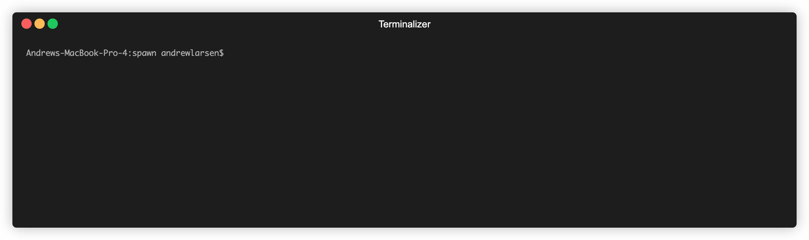
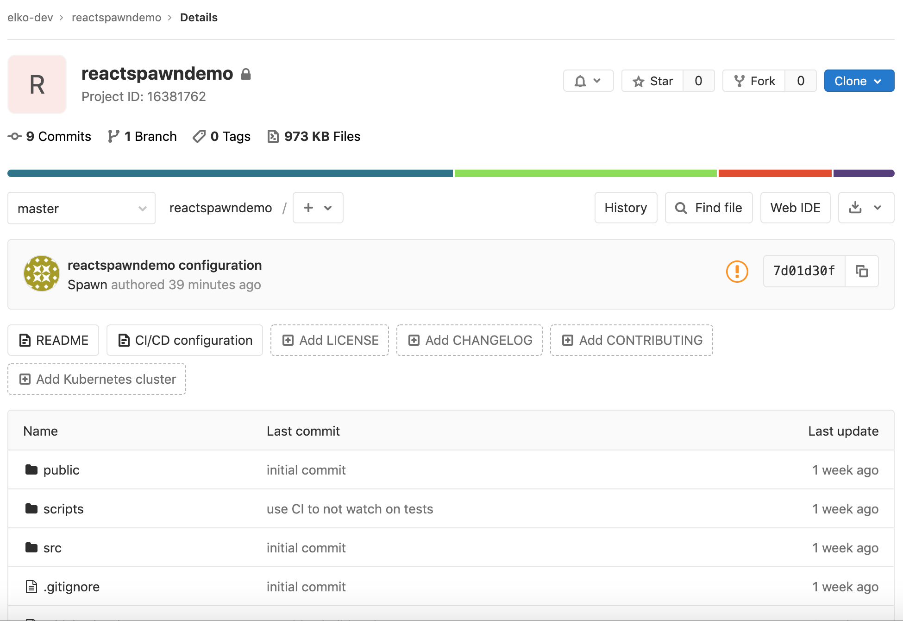
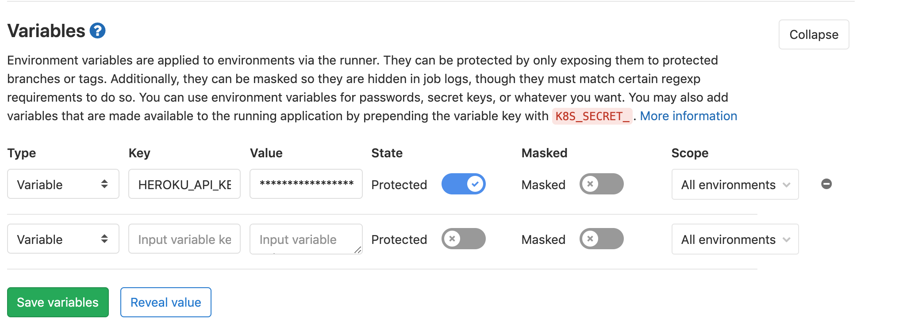
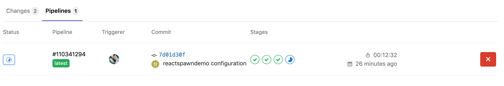
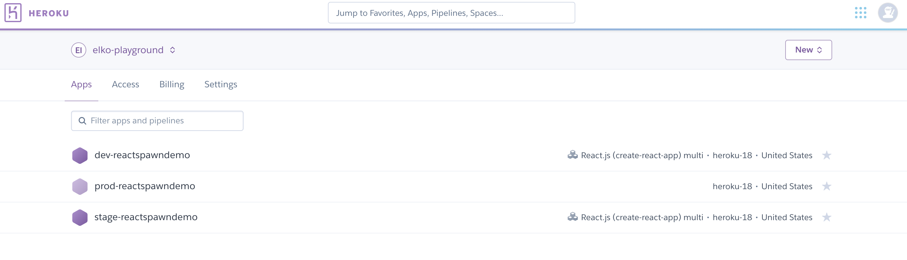

# spawn
[](https://circleci.com/gh/elko-dev/spawn) [](https://goreportcard.com/report/github.com/elko-dev/spawn)

Spawn is a project scaffolding tool. It is designed to take an opinion on how to build web and mobile application front and backends.  It relies on a number of open source tools and frameworks to help bootstrap you applications, enforce best practices, and save time! 

### Spawn's origins
[Elko](https://elko.dev) is a Software Development firm that specializes in product based application and cloud development.  We strive to build the best products for our customers, and for the best price!  We are always looking for ways to make our processes more efficient, particularly from an engineering perspective.  One thing our engineers noticed is that we spent time at the start of each project doing the same things.  Creating our initial applications, standing up CI pipelines, deployment platforms, integrating with user management services like [Firebase](https://firebase.com/), creating our initial Web/Mobile integrations with our GraphQL apis, etc.  We realized that we could save time (and thus save our clients money!) if we began to automate these processes.  We can also ensure consistancy across our projects, enforce best practices, and gain additional development speed through these efficiencies

## Supported Platforms
1. Heroku
2. Gitlab
3. Gitlab CI

Spawn relies on tokens from the various supported platforms to create resources on your behalf.  The following documentation can help to get setup on the supported platforms
1. [GitLab](#https://docs.gitlab.com/ee/user/profile/personal_access_tokens.html)
2. [Heroku](https://help.heroku.com/PBGP6IDE/how-should-i-generate-an-api-key-that-allows-me-to-use-the-heroku-platform-api)


## Supported Languages
1. React
2. NodeJs

The supported languages are based off of a set of curated template applications.  They have been designed and built for the purpose of the [Elko](elko.dev).  However, Spawn allows you to bring your own template as well!  Simply override the Elko template and provide your own git repository and let Spawn do the rest!

### Usage
Spawn is an interactive CLI application.  Spawn will guide you through the process of selecting what type of application you want to build, the platforms that will host it, and any additional configuration required.

In order to "spawn" an app, simple use the *application* command and let spawn walk you through the setup process:
``` bash
./spawn application
```

Let's walk through an example.  We will create a React application, hosted in Heroku, versioned in Gitlab, and leveraging Gitlab CI for Continuous Integration and Continuos Deployment.


The above gif shows the configuration required to create our apps.  In it we provided the following values:

| Parameter           | Values         | Description                                                                           |
|---------------------|----------------|---------------------------------------------------------------------------------------|
| Application Type    | React / NodeJS | Type of application to create.  Currently supported options are React and NodeJS      |
| Project Name        | string         | Name of project to generate.  Currently only support lowercase string values          |
| Heroku Access Token | string         | Token for Spawn to use to create required Heroku deployments                          |
| Heroku Team Name    | string         | Name of Heroku team to create Heroku deployments into                                 |
| Gitlab Access token | string         | Token for Spawn to use to create Gitlab repository                                    |
| Gitlab Group Id     | string         | Id of Gitlab Group to create repository in, if left blank will create in your account |

Don't worry, the Heroku and Gitlab tokens have been rotated ;)

Now let's take a look at what was created.  

Our application was uploaded to Gitlab with our project specific configuration, including the required deployment configuration

**Gitlab Repo**

**Gitlab Configuration**


And our app was deployed successfully to Heroku.  *Note - Spawn currently supports dev, stage, and production environments*

**Gitlab CI**

**Heroku Apps**


### Installation
