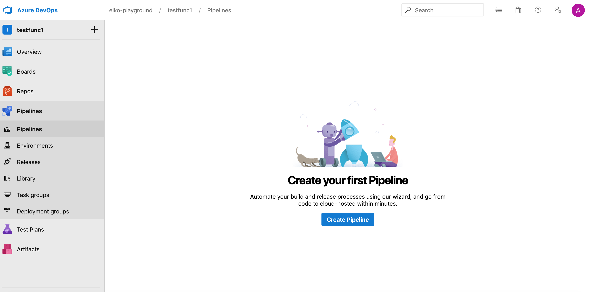
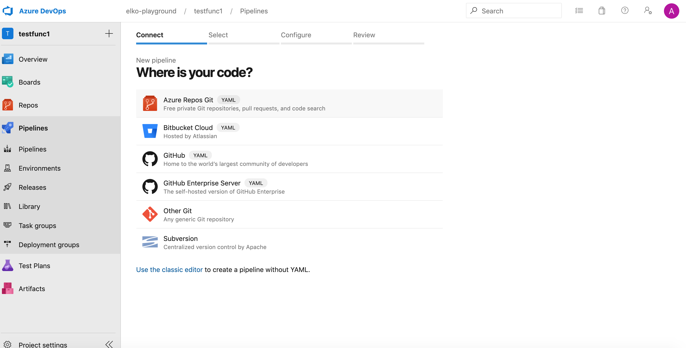
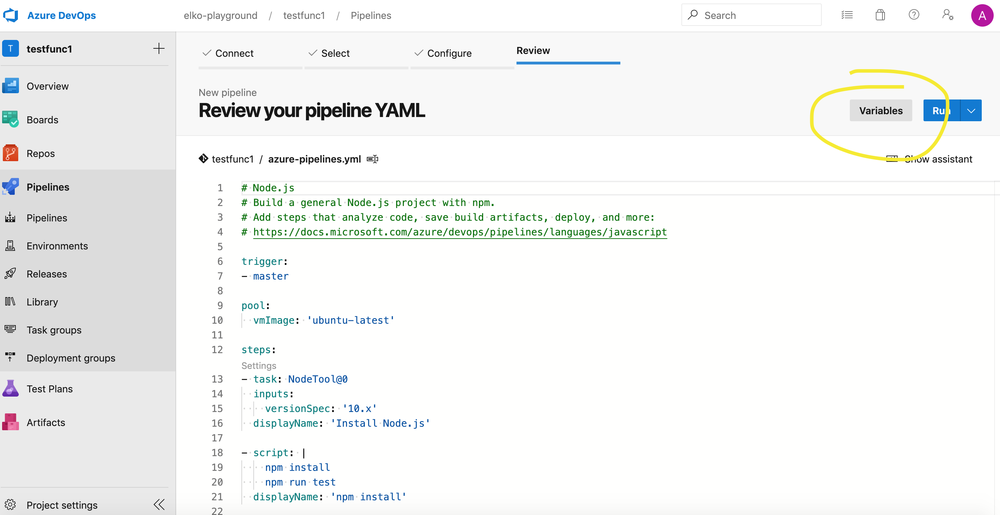

# In order to create an azure functions application there are three steps required

1. Use spawn to generate the initial application template
2. Create new Azure Pipeline
3. Configure Azure Functions credentials to Azure pipeline

1. Use spawn to generate the initial application template
This ones easy.  Just run ```./spawn application``` and let spawn guide you through the rest.  You will need an [ADOS](https://dev.azure.com/) Organization and a user's [Personal Access Token](https://docs.microsoft.com/en-us/azure/devops/organizations/accounts/use-personal-access-tokens-to-authenticate?view=azure-devops&tabs=preview-page)

2. 
Once the application is created, navigate to the applications pipeline section and select **create pipeline**

then select **Azure Repos Git** and your function name.  

Navigate to the final screen and enter your environment variables as described in step 3 below


3. Configure Azure Function with credentials.

First, we need to grab credentials for our Azure user. Follow the below commands:
first login:
``` bash
$ az login
```
output:
``` json
[
  {
    "cloudName": "<cloudName>",
    "id": "<subscription-id>",
    "isDefault": true,
    "name": "<name>",
    "state": "<state>",
    "tenantId": "<tenantId>",
    "user": {
      "name": "<name>",
      "type": "<user>"
    }
  }
]
```
Then, take the id from above output and use as the subscription id below
```bash
$ az account set -s <subscription-id>
```
Next, create a [Service Principle](https://stackoverflow.com/questions/48096342/what-is-azure-service-principal/48105935) for your Azure Subscription
```
$ az ad sp create-for-rbac --name <name>
```
the output will be as follows:
```json
{
  "appId": "<servicePrincipalId>",
  "displayName": "<name>",
  "name": "<name>",
  "password": "<password>",
  "tenant": "<tenantId>"
}
```
Finally, navigate back to the pipelines page and input the following environment variables 
```
AZURE_SUBSCRIPTION_ID='<subscriptionId>'
AZURE_TENANT_ID='<tenantId>'
AZURE_CLIENT_ID='<servicePrincipalId>'
AZURE_CLIENT_SECRET='<password>'
```